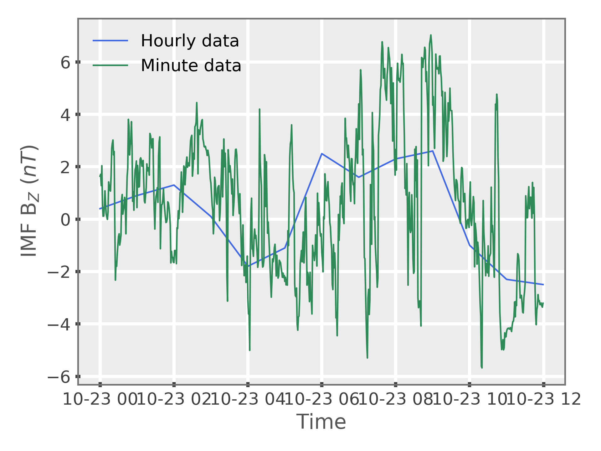

# One-Minute OMNI and Qin-Denton Data

This package heavily leverages OMNI data (a multi-satellite database of solar
wind files) and Qin-Denton data (a data product of OMNI data).  These data
bases are used by Spacepy to configure the empirical models used, in turn,
by this analysis package.  Spacepy comes with hour-resolution data, which is
sufficient for many purposes.  However, it is often desireable to obtain
one-minute resolution values -- indeed, that is the case here.

## Obtaining One-Minute Values

A database of one-minute values can be [found via this URL.](https://rbsp-ect.newmexicoconsortium.org/data_pub/QinDenton/).  The keen researcher may wish to automate this effort:

```
>>> wget -r -A *.txt https://rbsp-ect.newmexicoconsortium.org/data_pub/QinDenton/
```

## Using one-minute data within Spacepy:

Detailed instructions can be found in Spacepy module docstrings.  In
IPython, use the following syntax:
```python
>>> from spacepy import omni
>>> omni?
>>> omni.get_omni?
```
Specifically, see the section on advanced features.

After obtaining the Qin-Denton data as described above, place it in any
desired location locally.  Then, add the following line to your Spacepy
configuration file in ```~/.spacepy/spacepyrc```:

```
qd1min: /path/to/your/directoy/YYYY/QinDenton_YYYYMMDD_1min.txt
```

...where you must obviously customize the path to the location where you
saved your 1-minute resolution data.

## Testing Data Availability
If you've done everything above successfully, the *test_omni.py* script
should plot the 1-hour vs. 1-minute data and show obvious differences:

```python
>>> run test_omni.py
```


